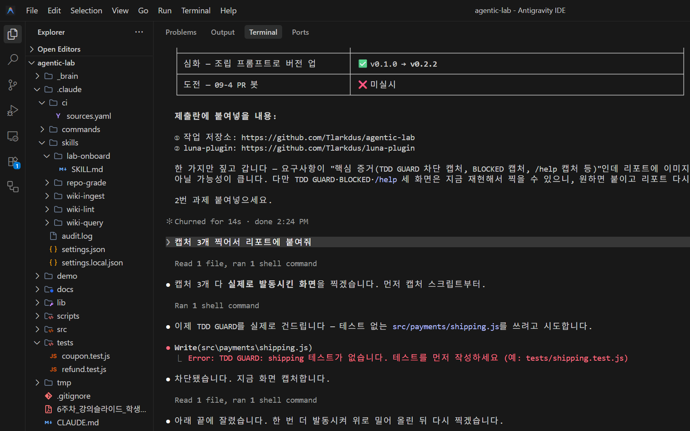

# 6주차 실습 일지 — 자산 공장

## 완료한 LAB 체크리스트

- [x] LAB 01
- [x] LAB 02
- [x] LAB 03
- [x] LAB 04
- [x] LAB 05
- [x] LAB 06
- [ ] LAB 07
- [x] LAB 08
- [x] LAB 09
- [x] LAB 10
- [ ] LAB 11

## LAB별 기록

### LAB 01

- **산출물 경로**: `CLAUDE.md` (+ `GOLDEN_RULES.md`, `src/payments/.agent-rules.md`)
- **핵심 증거**: 감사 판정표 14행(조항 | 판정 | 근거 파일 | 수정 제안) — 유효 12 / 모순 1 / 낡음 1.
  커밋 `2c20069 docs: audit fix` (모순·낡음 3건 수정), `58b6167`·`3505299 docs: revise from session (week6)`
  (규칙 충돌 우선순위 조항, 행동 원칙 5번 신설). 대조 근거: `npm test` 10/10 pass, `grep console.log` 결과,
  `git show HEAD:CLAUDE.md`
- **관찰**: 헌법을 재구술시키니 "결제 로그에 `console.log` 금지" 한 문장이 두 가지로 읽힌다는 걸 알았다 —
  호출부 금지인지 `lib/logger.js` 구현까지 금지인지. 문자 그대로면 승인된 로거 자체가 규칙 위반이었다.

### LAB 02

- **산출물 경로**: `.claude/skills/repo-grade/SKILL.md` (5카테고리 × 20점 루브릭),
  `CLAUDE.md`, `.claude/settings.local.json` (allow 25건 → 11건, 백업 scratchpad/`settings.local.json.bak`)
- **핵심 증거 (채점·개선)**: 스킬 커밋 `117f52b`. 첫 채점 80/100 (A20 B10 C20 D20 E10),
  최저 카테고리 B·E 동률 10점. ROI 3: ① CLAUDE.md 감량 +10 ② 구조 섹션에 스킬 기재 +10
  ③ 코드 git 추적 +0(방어 — 현재 점수는 워킹트리 기준, 클론에선 A·D가 함께 무너짐) →
  ROI #1 `8774e45` CLAUDE.md 40줄→35줄로 B 10→20 → ROI #2 `4530ac0` 구조 섹션에 스킬 기재로 E 10→20 →
  **100/100**. 매 단계 `npm test` 10/10 pass
- **핵심 증거 (sanity)**: `grep -rn "^import|require("` 전수 조사 — 살아있는 그래프는
  `tests/refund.test.js` → `src/payments/refund.js` → `lib/logger.js` 하나뿐. 후보표 9행,
  제거 14건(타 저장소 9, 위험·1회성 5), 보류 4건. 커밋 `b819270`
- **관찰 1**: 내가 만든 루브릭이 내가 방금 추가한 줄을 잡았다 — 규칙을 더할수록 헌법이 40줄로 불어나
  B가 감점됐다. 채점 기준을 스스로 어긴 걸 스스로 찾는 게 스킬의 값어치였다.
- **관찰 2**: 재검증을 시키니 E 감점 근거 2건이 모두 무너졌다(폴더 규칙은 범위상 옳았고, `ts`는 로거 내부
  생성 필드였다). 점수는 80으로 같았지만 "맞는 점수를 틀린 이유로" 낸 상태였다.
- **관찰 3**: 죽은 코드보다 죽은 **권한**이 위험했다 — `rm -f CLAUDE.md GOLDEN_RULES.md ...`가 allow에 남아
  헌법 파일 삭제가 무승인 통과되는 상태였다. gitignore 대상이라 정리가 커밋으로 증명되지 않는다.

### LAB 03

- **산출물 경로**: `_brain/` (index.md, log.md, raw/ 2건, decision/ 3노드, postmortem/ 1노드),
  `CLAUDE.md` "지식 저장소(_brain) 규칙" 섹션, `.claude/skills/wiki-ingest/SKILL.md`,
  `.claude/skills/wiki-query/SKILL.md`
- **핵심 증거**: `779ae53` 스키마 층(위치·status/sources·[[링크]]·raw 불변·모순 병기·민감정보 배제,
  35줄→38줄 허용치 내) → `a73435a` raw 노트 2건 원본 보관 → `1069dd8` 첫 ingest
  (raw 2건 → 노드 4개: repo-standards/team-toolchain solid, audit-log draft, observations solid;
  index.md·log.md 신설, raw 무수정을 git status로 확인) → `947508e` wiki-query.
  질의 2건 대조: 인용 답변(게이트=npm test, 5주차 8/6 — 노드 + raw 원문 2단 인용) /
  "아직 없음" 답변(luna-plugin 롤백 절차 — `grep -rn` 0건 근거)
- **관찰 1**: 원본을 안 고치니 모순이 사라지지 않고 남았다 — 5주차 "CLAUDE.md 35줄 이내" vs 현재 38줄이
  `repo-standards`의 "모순/주의"에 출처·커밋과 함께 병기됐다. 지웠으면 규정 개정 안건 자체가 증발했다.
- **관찰 2**: 조회 스킬의 값어치는 "없다"고 말할 수 있는 데서 나왔다. `team-toolchain`에 luna-plugin이
  적혀 있는데도 롤백 절차로 넘겨짚지 않은 답변이, 인용 답변 쪽 신뢰의 근거가 된다.
- **관찰 3**: 노드화하자마자 파일 남발 유혹이 바로 왔다. 추출 항목 9개를 노드 4개로 묶고,
  raw가 이미 회의록이라 `meeting/`은 만들지 않았으며, 정의가 없는 용어는 stub 대신 index 한 줄로 남겼다.

### LAB 04

- **산출물 경로**: `.claude/ci/sources.yaml`, `.claude/skills/lab-onboard/SKILL.md`,
  `_brain/_index/knowledge-map.md`, `_brain/log.md`(실행 기록 1줄)
- **핵심 증거**: `0132c80` sources.yaml — code/rules/knowledge/reports/external 5그룹, 항목마다
  한 줄 주석, 12개 경로 `-e` 검증으로 `_brain/meeting/` 1건 제외 → `0d18a1b` lab-onboard +
  첫 지도(주제 7행, 신선도 mtime 기준, FAQ 5문항 전부 경로로 답, "목록 누락 의심" 5건 보고)
- **핵심 증거 (4-3 비교)**: 같은 질문 "커밋 전 반드시 통과해야 하는 검증은?" 2회.
  지도 없이 = `[[repo-standards]]:10` + `raw/2026-08-06-week5.md:2` + 헌법 조항.
  지도와 함께 = 위 전부 + `knowledge-map.md:20-21` FAQ + `package.json:7` `"test": "node --test"`.
  답은 `npm test`로 같고, 차이는 도달 경로와 깊이(결정 → 실제 실행 명령까지)
- **관찰 1**: 신선도 칸이 세션의 실체를 드러냈다 — 코드는 `보통`(2026-08-12), 규칙·지식·보고서는
  `최근`(2026-09-08). 이번 주 내내 문서만 고치고 코드는 손대지 않았다는 사실이 표 한 칸에 남았다.
- **관찰 2**: 출처 목록을 만들자 목록 자체의 구멍이 보였다. `lib/logger.js`(결제 로그의 유일한 출구)와
  `docs/payment-rules.md`가 `sources.yaml`에 없다. 스킬이 자동 수정 대신 "누락 의심"으로 보고하게
  해둔 덕에, 목록을 고칠지 말지는 사람 판단으로 남았다.
- **관찰 3**: 지도가 답을 바꾸지는 않았다. 바꾼 건 답에 닿는 경로다 — 위키만 보면 "무엇을 결정했나"에서
  멈추고, `code:` 그룹까지 내려가야 "그 결정이 어떤 명령으로 구현돼 있나"가 나온다.

### LAB 05

- **산출물 경로**: `C:\Users\sgy46\luna-plugin` (= https://github.com/Tlarkdus/luna-plugin, `main`) —
  `.claude-plugin/marketplace.json`(매장 `luna`), `luna-toolkit/.claude-plugin/plugin.json`(상품),
  `commands/repo-grade.md`, `skills/repo-grade/SKILL.md`, `hooks/hooks.json`, `scripts/tdd-guard.sh`
- **핵심 증거 (5-1~5-4)**: 커밋 `df2a0f8`(뼈대) → `524e2aa`(커맨드+스킬) → `64a58cc`(훅 2종) → `da65366`(README).
  설치 `✓ Installed luna-toolkit. Plugin is now active.` —
  `~/.claude/plugins/installed_plugins.json`에 `luna-toolkit@luna` scope `user`, `gitCommitSha da65366`.
  훅 경로는 `${CLAUDE_PLUGIN_ROOT}` 기준 2곳(`hooks.json:9`, `commands/repo-grade.md:5`)
- **핵심 증거 (5-5 타 폴더 검증)**: `plugin-test`(로컬 `.claude/skills/` 없음)에서 `/repo-grade` → **0/100**.
  루브릭 5항목의 0점 조건("문서가 없다"·"CLAUDE.md가 없다"·"테스트가 없다")을 전부 만족하는 빈 저장소라
  0점이 정상 동작의 증거
- **핵심 증거 (5-6 갱신)**: `97b3136`으로 총평 행 규칙 추가 + version 0.1.1 →
  `/plugin marketplace update luna` → `✔ Updated 1 marketplace (1 plugin bumped)`,
  캐시에 `0.1.0`·`0.1.1`·`0.1.2` 세 디렉터리 생성 확인
- **관찰 1 (배포판은 원본이 없는 곳에서만 검증된다)**: v0.1.1 갱신 후 작업 저장소에서 `/repo-grade`를 돌렸는데
  총평 행이 나오지 않았다. 화면 상단 `Base directory: ...agentic-lab\.claude\skills\repo-grade` —
  **같은 이름이면 로컬 스킬이 플러그인을 가린다.** 업데이트가 안 된 게 아니라 보이지 않았을 뿐이었다.
  슬라이드 148의 "한쪽을 진실로 정하라"가 취향 문제가 아니라 검증 가능성의 문제였다
- **관찰 2 (경로 문제와 권한 문제는 증상이 같다)**: 커맨드가 상대경로 `skills/repo-grade`를 쓰는 걸 발견하고
  `${CLAUDE_PLUGIN_ROOT}` 기준으로 고쳤는데(`93b45c7`) 증상이 그대로였다 — 루브릭을 못 찾아 A~E 대신
  9항목 배점을 지어냈다. 원인은 경로가 아니라 `-p` 모드의 디렉터리 샌드박스였고,
  `--add-dir`로 캐시를 열자 즉시 통과했다. 둘 다 "파일을 못 읽는다"로 나타나 구분이 안 됐다
- **관찰 3 (커맨드는 왜 얇아야 하나)**: 내 커맨드는 "스킬 파일을 읽어라"라고 시킨다 — 그래서 읽기 권한에
  의존한다. 스킬은 `luna-toolkit:repo-grade`로 자동 등록되므로 애초에 읽으라고 시킬 필요가 없었다.
  얇은 커맨드가 좋은 건 미학이 아니라 **의존성이 하나 줄어들기 때문**이었다
- **핵심 증거 (5-5 훅 발동)**: `hook-test`(로컬 `.claude/` 없음)에서 Write 툴로 `src/hello4.js` 요청 →
  `Error: TDD GUARD: hello4 테스트가 없습니다. 테스트를 먼저 작성하세요 (예: tests/hello4.test.js)`.
  차단당한 에이전트가 `tests/hello4.test.js`를 먼저 쓰고 `src/hello4.js`를 `module.exports`로 바꿔
  다시 통과했다 — deny의 처방을 그대로 따랐다.
  `/hooks` → PreToolUse에 `[Plugin] Bash`·`[Plugin] Edit|Write` 두 항목
- **관찰 5 (훅은 세 번 실패한 뒤에야 붙었다)**: 위 결과에 도달하기까지 원인이 세 번 바뀌었다.
  ① Bash로 파일을 써서 `Edit|Write` 매처를 안 거침 → 사각지대(우회가 아니라 범위 문제)
  ② Write로 해도 안 걸림 → `plugin.json`에 `hooks` 선언이 없어서라고 판단했으나 **오진**
     (문서상 `hooks/hooks.json`은 자동 인식이고 둘은 병합된다)
  ③ 진짜 원인 — `hooks.json`이 **유효한 JSON이 아니었다.** audit 명령의 `sed` 치환에 `\(`가 있었고
     JSON이 허용하지 않는 이스케이프라 `JSON.parse`가 position 911에서 실패, 파일 전체가 버려졌다.
     `/hooks`에 `No hooks configured`로 나타났다 — **v0.1.0부터 훅은 한 번도 로드된 적이 없었다.**
  배운 것: 훅 파일은 눈으로 읽어서 검증되지 않는다. **파서에 넣어보는 게 유일한 확인**이다.
  그리고 파싱 실패는 에러를 내지 않고 조용히 "훅 없음"이 된다 — 종합 관찰 3번의 사례가 하나 더 늘었다
- **갱신 정책 ("안 하는 사람 대책", 이론 58)**: 우리 팀 문장 — **"매주 수요일 수업 시작 = update 타임."**
  누가 갱신했는지 묻지 않는다. 세션을 새로 열 때 `/plugin marketplace update luna` 한 줄을 치는 것을
  출석처럼 다룬다. 강제할 수단이 없는 규칙은 시각에 묶어야 지켜진다
- **관찰 4 (실패는 조용하다)**: `marketplace add`에 없는 경로를 줬을 때 에러 없이 아무 출력도 없었다.
  다음 줄 `install`의 `Marketplace "luna" not found`로 거슬러 올라가서야 알았다.
  등록 여부의 진짜 확인처는 `~/.claude/plugins/known_marketplaces.json`

### LAB 06

- **산출물 경로**: `scripts/hooks/tdd-guard.sh`, `scripts/hooks/todo-guard.sh`,
  `.claude/settings.json`(PreToolUse 2건: `Edit|Write` → tdd-guard, `Bash` → todo-guard),
  `src/payments/coupon.js`, `tests/coupon.test.js`
- **핵심 증거 (6-1 설계 3원칙)**: `ff0f9b2 feat: tdd-guard hook` — 세 원칙이 코드 세 블록에 그대로 대응.
  (a) 면제가 절반 — 경로 없음·`*test*`·`.md/.json/.yml/.yaml`·`src/` 밖은 전부 exit 0.
  (b) 관대한 탐색 — `$root/tests/<name>.test.js`, `tests/<name>.test.js`, 같은 폴더 3후보를 모두 인정.
  (c) 친절한 deny — 메시지에 만들 파일 경로까지 박아 넣는다(`예: tests/<name>.test.js`).
  Windows 역슬래시를 8진 이스케이프로 만든 `tr`로 정규화하는 처리도 두 훅이 동일
- **핵심 증거 (6-2 단독 테스트, deny 1 · 통과 1)**: 훅에 PreToolUse JSON을 직접 물려 재확인.
  `src/payments/coupon.js` → 무출력 exit 0(통과) / `tests/coupon.test.js` → 면제로 통과 /
  `src/payments/tax.js` → `{"permissionDecision":"deny", ... "TDD GUARD: tax 테스트가 없습니다.
  테스트를 먼저 작성하세요 (예: tests/tax.test.js)"}`
- **캡처 (6-2 재현, 2026-09-16)**: `docs/img/lab06-tdd-guard.png` — 테스트 없는 `src/payments/shipping.js`에
  Write를 시도하자 `Error: TDD GUARD: shipping 테스트가 없습니다. 테스트를 먼저 작성하세요
  (예: tests/shipping.test.js)`로 거부됐고 파일은 생성되지 않았다(`Test-Path` → False)

  
- **핵심 증거 (6-4 RED→GREEN 한 사이클)**: `fc62d9a feat: coupon with tdd-guard`
  (`src/payments/coupon.js` +28, `tests/coupon.test.js` +16 — 테스트와 구현이 한 커밋).
  3케이스 GREEN: 정상 할인(10000에 10% → `netMinor` 9000) / `rate <= 0` → `RangeError` /
  `rate > 1` → `RangeError`. 전체 `npm test` **13/13 pass**(쿠폰 3 + 환불 10).
  비율은 경계에서만 소수로 받고 `Math.round(rate * 10_000)` basis point 정수로 환산 —
  금액에 부동소수 곱이 닿지 않는다(GOLDEN RULES 2)
- **핵심 증거 (6-5 TODO 커밋 차단)**: `7eceb12 feat: todo commit guard`.
  `coupon.js` 첫 줄에 미처리 표시 주석을 넣고 커밋 시도 →

  ```
  PreToolUse:Bash hook error: [bash "$CLAUDE_PROJECT_DIR/scripts/hooks/todo-guard.sh"]:
  BLOCKED: TODO/FIXME가 남아 있습니다. 정리하거나 이슈로 옮기세요
    - C:/Users/sgy46/agentic-lab/src/payments/coupon.js
  ```

  정리 후 `git restore --staged --worktree`로 원복(주석만 지우면 diff 0 — 커밋할 변경이 남지 않는다)
- **핵심 증거 (6-5 부수 발견: 가드 구멍)**: 같은 변경이 호출 형태에 따라 갈렸다.
  `git add X && git commit -m ...`(한 명령) → **통과**, `git add X` → `git commit -m ...`(분리) → **BLOCKED**.
  PreToolUse는 명령 실행 *전*에 돌아 `git diff --cached`가 비어 있고,
  todo-guard.sh의 `[ -z "$files" ] && exit 0`으로 빠져나간다. `git commit -a`도 같은 경로로 뚫린다
- **핵심 증거 (6-5 부수 발견: 오탐과 수정)**: 이 보고서를 커밋하려 하자 **보고서 자신이 차단**됐다
  (`BLOCKED: ... - report-week6.md`) — 차단 캡처를 증거로 실었기 때문. todo-guard.sh가 자기 소스에서
  낱말을 `'TO''DO'`로 쪼개 쓰는 것과 같은 문제를 문서에서 다시 만난 것이라, tdd-guard의 "면제가 절반"과
  같은 모양으로 `*.md` 면제 1줄을 추가했다(`case "${f##*/}" in *.md) continue ;; esac`).
  검증: 면제 후 훅 exit 0, `.js`·`lib/` 경로는 그대로 검사 대상. 훅 수정과 이 기록은 같은 커밋
- **hard/soft 판단**: 우리 팀이라면 **hard, 단 탈출구를 붙인 hard**. 미처리 표시는 "나중에"가 영원히
  오지 않는 대표 항목이라 soft 경고는 두 번째부터 스크롤에 묻힌다. 대신 순수 차단만 두면 우회 압력이
  생기므로, 이슈 번호가 붙은 형태(`TODO(#123)`)는 통과시키는 예외를 함께 둔다 — 그래야
  "정리하거나 이슈로 옮기세요"라는 처방이 실제로 실행 가능해진다.
  강도는 기술이 아니라 정책 결정이다: 훅 설계의 절반은 "무엇을 막나"가 아니라 **"막힌 사람이 어디로
  갈 수 있나"**이고, 탈출구 없는 hard는 규칙이 아니라 장애물이 된다
- **관찰 1**: 차단 메시지가 처방을 담고 있으니 우회 시도가 나오지 않았다. `--no-verify`나 낱말 바꿔치기
  대신 곧장 "지우거나 이슈로 옮긴다"로 갔다 — deny의 값어치는 막는 힘이 아니라 **다음 한 걸음을
  지정해 주는 데** 있었다.
- **관찰 2**: 가드를 뚫은 건 악의가 아니라 습관이었다. `git add && git commit`을 한 줄로 붙이는 일상적
  편의가 PreToolUse 타이밍과 만나 훅을 무력화했다. 훅의 구멍은 공격이 아니라 **정상적인 사용 습관**에서
  열린다 — 그래서 훅은 "우회 가능한가"보다 "평소 쓰는 형태로도 걸리나"로 시험해야 한다.
- **관찰 3**: 같은 저장소에 강도가 다른 두 훅이 공존한다. tdd-guard는 면제 목록이 본문의 절반이고
  (deny JSON, 되돌릴 수 있음), todo-guard는 면제가 하나도 없다(exit 2, 커밋 자체를 끊음).
  전자는 "쓰면서 배우게" 설계됐고 후자는 "새는 걸 막게" 설계됐다 — 훅마다 목적이 다르면 강도도 달라야
  한다는 게, 두 파일을 나란히 놓고서야 보였다.

### LAB 07

- **산출물 경로**:
- **핵심 증거**:
- **관찰**:

### LAB 08

- **산출물 경로**: `scripts/token-report.js` (분석기), `.claude/settings.json` Stop 훅
- **핵심 증거 (8-1 로그 탐색)**: `~/.claude/projects/C--Users-sgy46-agentic-lab/` 아래 `.jsonl` 10건,
  62KB~2.9MB. 한 turn의 usage 4필드 실측 — `input_tokens` **2** / `output_tokens` 1,585 /
  `cache_creation_input_tokens` 3,136 / `cache_read_input_tokens` **73,773**.
  cache_read가 input의 3만 배 — 캐시가 일하는 turn을 눈으로 확인
- **핵심 증거 (8-2 분석기)**: `15d18fb feat: token report script`. 10개 세션 / 1,001 turns /
  총 113,204,249 tokens(출력 806,686 · 입력 112,397,563 캐시 포함) · 출력:입력 = 1 : 139.3.
  깨진 줄과 usage 없는 줄 2,645개를 건너뛰고 개수만 보고 — 샘플 JSONL(불량 2줄 + 정상 1줄)로 내성 확인
- **핵심 증거 (8-3 해석 5단계)**: ① 총량 113.2M / 1,001 turns ② 히트율 — 슬라이드 공식은 **100.0%**,
  실질 **98.2%** ③ 가장 비싼 지점은 출력 과다도 캐시 미스도 아닌 **캐시 쓰기 1,981,599 토큰**(×1.25 구간)
  ④ 패턴 후보 2개 — (a) 짧은 세션을 새로 여는 습관: 5 turn짜리 `5710b4bf`는 쓰기 비중 16.2%인데
  311 turn짜리 `94ab5cd0`은 1.3%다 (b) 훅을 만질 때마다 `/exit` 재시작이 강제돼 prefix가 다시 쓰인다
  ⑤ **절감안**: 짧은 질문으로 새 세션을 열지 않는다 — 훅 수정처럼 재시작이 필요한 작업은 몰아서 한 번에
- **관찰 1 (지표가 100%면 지표가 아니다)**: 슬라이드 공식 `cache_read/(input+cache_read)`를 그대로 썼더니
  10개 세션이 전부 100.0%였다. Claude Code가 `input_tokens`를 turn당 2 정도로만 보고하고 나머지를
  캐시 필드로 넘기기 때문에 분모가 사실상 `cache_read` 하나뿐이다. 캐시 쓰기를 분모에 넣은 칸을 따로 다니
  83.8%~98.7%로 갈라졌다 — **같은 데이터에서 아무것도 구분 못 하던 숫자가 구분을 시작했다.**
- **관찰 2 (비싼 건 길이가 아니라 시작이었다)**: 절감 대상이 "말을 짧게"일 줄 알았는데 출력은 전체의 0.7%였다.
  굵은 건 세션을 새로 여는 순간의 캐시 쓰기였고, 그건 내가 이번 주 훅을 고칠 때마다 강제로 한 재시작이다.
  가드를 만드는 비용이 토큰 청구서에 찍혀 있었다

### LAB 09

- **산출물 경로**: `.claude/commands/review.md`, `.claude/commands/risk-score.md`.
  9-4(Post-PR 봇)는 미실시 — GitHub Secrets 환경이 필요해 안내까지만
- **핵심 증거 (9-1 `/review`)**: `495232b feat: review command`. 첫 실행 대상이 자기 직전 커밋 2건이었고
  ❌ 3건이 나왔다 — ③ 새 코드 119줄에 대응 테스트 0(`tests/`엔 coupon·refund 둘뿐),
  ⑤ `CLAUDE.md:22` 구조 섹션이 스킬 5개 중 1개·커맨드 2개 중 1개만 알고 있었음,
  ① 슬라이드 범위를 넘은 `실히트율` 칸 추가. `31ce29c`에서 ③·⑤ 정리(`npm test` 13 → **16 pass**)
- **핵심 증거 (9-2 위반 심기)**: `experiment.js`(하드코딩 시크릿 `sk-test-1234` + 결제 금액 `console.log`)
  와 `src/payments/coupon.js`의 이유 없는 리네임(`applyCoupon` → `calcCouponDiscount`)을 심었다.
  `/review` 결과 **5항목 전부 ❌** — 시크릿(②)과 범위 밖 리네임(④)이 의도한 둘이고,
  그 리네임이 `tests/coupon.test.js:3`의 import를 깨뜨려 ③까지 번졌다(`npm test` 14 tests / **1 fail**).
  복구 후 16/16 pass, `git log --all -S "sk-test-1234"` **0건** — 시크릿은 이력에 넣지 않았다
- **핵심 증거 (9-3 `/risk-score`)**: `7bcca30`. 같은 자로 잰 두 diff —
  평시(LAB 08·09 커밋 4건) Security 2 / Scope 4 / Breaking 0 / Tests 3 / Migration 6 = **15점 🟢 셀프 머지**,
  위반 diff Security 28 / Scope 16 / Breaking 18 / Tests 14 / Migration 2 = **78점 🔴 머지 보류**
- **관찰 1 (거울은 자기부터 비췄다)**: `/review`를 만들자마자 첫 대상이 내가 방금 쓴 커밋이었고, 바로 ❌ 3건이
  나왔다. 그중 "새 코드에 테스트 0"은 내가 스스로 지키기로 한 원칙인데도 커밋까지 간 상태였다.
  LAB 02의 루브릭이 그랬듯, 검사기의 첫 피해자는 언제나 제작자였다
- **관찰 2 (한 글자가 세 항목이 됐다)**: 함수명 하나를 바꿨을 뿐인데 ①Surgical·③테스트·④범위 밖·⑤문서가
  동시에 ❌가 됐다. 위험이 파일 수가 아니라 **연결 수**를 따라 번진다는 게 표로 보였다 —
  risk-score에서 Breaking 18점이 붙은 것도 같은 이유다
- **관찰 3 (막을 가드가 끼어들 기회조차 없었다)**: 슬라이드는 위반을 심을 때 "TDD 가드가 막겠구나"를
  예상하고 면제 경로를 안내했다. 그런데 가드는 **아예 돌지 않았다** — 매처가 `Edit|Write`라
  Bash로 파일을 쓰면 통과다. 면제 경로를 고민할 필요도 없었다는 사실이 오히려 구멍이었다
- **관찰 4 (Migration 축이 뒤집혔다)**: 5축 중 하나는 위반 diff가 평시보다 **낮았다**(2 vs 6).
  훅 스키마를 건드린 평시 변경이 되돌리기 어렵고, 시크릿을 심은 실험은 파일만 지우면 끝이기 때문.
  "위험한 변경"이 한 덩어리가 아니라 축마다 다른 방향을 가리킨다는 걸 배점이 드러냈다

### LAB 10

- **산출물 경로**: `scripts/hooks/bash-guard.sh` (4패턴 Prevent), `.claude/settings.json` PostToolUse(Detect),
  `.claude/audit.log` (75줄 축적). ◇10-5 worktree 격리는 미실시
- **핵심 증거 (10-1·10-2 Prevent)**: 커밋 `9fed790`은 인라인 한 줄 훅이었고 **실제로는 아무것도 막지 못했다**.
  원인 둘 — `$CLAUDE_TOOL_INPUT`은 존재하지 않는 변수라(입력은 stdin JSON) grep이 빈 문자열을 훑었고,
  `exit 1`은 차단이 아니라 경고다. `9a984cb`에서 `scripts/hooks/bash-guard.sh`로 분리 + `exit 2`로 수정.
  검증: 위험 명령 시도 → BLOCKED(exit 2), 대상 폴더 보존, `npm test` 13/13 pass
- **핵심 증거 (10-3·10-4 Detect·판독)**: LAB 05 진행 중 `git reset --hard`를 시도했다가 실제로 차단당했고,
  그 명령은 `audit.log`에 **0건**이다(`grep "reset --hard"` → No matches). 로그에 남은 건 20:07:10의
  우회 명령 `git reset -q HEAD^`뿐 — Prevent에서 죽은 명령은 Detect에 도달하지 않는다.
  PostToolUse는 이름 그대로 실행 *후*에 돌기 때문
- **관찰 1 (층의 순서를 로그의 부재로 배웠다)**: audit.log만 보면 그 시각에 아무 일도 없었던 것처럼 보인다.
  "무엇을 막았는가"는 Prevent 층에만 있고 Detect 층에는 없다 — 사고 조사를 로그로만 하면
  **차단당한 시도는 통계에서 통째로 사라진다.** 두 층은 겹치는 게 아니라 서로를 못 본다
- **관찰 2 (가드는 정상 작업도 막는다, 그게 설계다)**: 되돌리기가 필요해 `git reset --hard`를 쓰려다 막혔고,
  `git checkout <sha> -- .` → `git reset HEAD^`로 우회해야 했다. 패턴이
  `rm[[:space:]]+-[a-zA-Z]*[rR]`이라 `rm -rf`뿐 아니라 **`rm -r`도 걸린다** —
  실습 폴더 삭제조차 에이전트에게 못 시켰다. over-guarding을 불평 대신 우회 경로로 처리한 건,
  가드를 넓게 잡은 게 의도였기 때문. 좁히는 순간 이유를 대야 한다
- **관찰 3 (Detect 층 자체가 취약했다)**: audit 훅은 `sed`로 JSON에서 `"command"`를 뽑는데,
  값 안에 이스케이프된 따옴표가 많은 명령을 만나자 **tool_use 응답 전체가 한 줄로 들어가** 로그가 오염됐다
  (일부 줄은 수천 자, `grep`이 binary로 판정). 막는 훅은 틀리면 시끄럽게 실패하지만(BLOCKED),
  기록하는 훅은 틀려도 조용히 쓰레기를 쌓는다 — Detect 층은 스스로 자기 고장을 알리지 않는다

### LAB 11

- **산출물 경로**:
- **핵심 증거**:
- **관찰**:

## 종합 관찰 3줄

1. **규칙은 판정 가능한 형태가 됐을 때 비로소 규칙이 됐다.** LAB 01에서 "결제 로그에 `console.log` 금지"
   한 문장이 두 가지로 읽힌다는 걸 알았지만, 문서를 고쳐도 애매함은 문장 안에 남았다.
   같은 규칙이 LAB 06·10에서 훅으로 내려오자 exit code 하나로 판정이 끝났다 —
   문서는 해석을 요구하고, 훅은 해석을 끝낸다. 헌법에서 가드로 내려오는 이번 주의 순서가 그 거리였다.
2. **내가 만든 검사기가 나를 먼저 잡았다.** LAB 02의 루브릭은 내가 방금 추가한 줄 때문에 B를 감점했고,
   LAB 10의 가드는 내 복구 명령(`git reset --hard`)을 막아 우회로를 찾게 했다.
   규칙을 자산으로 만든다는 건 남에게 줄 도구를 만드는 게 아니라,
   **자기 자신에게 먼저 적용되는 걸 감수하는 일**이었다. 불편했지만 한 번도 끄고 싶지는 않았다.
3. **이번 주의 실패는 전부 조용했다.** `marketplace add`는 없는 경로에 무반응이었고,
   인라인 Bash 훅은 안 막으면서 아무 말이 없었고, audit 훅은 오염된 로그를 계속 쌓았고,
   로컬 스킬은 플러그인을 가리면서 아무것도 알리지 않았다. 에러는 시끄럽지만 **미동작은 침묵**이다.
   그래서 이번 주에 배운 검증법은 하나로 요약된다 — 밖으로 나가서, 없어야 할 것이 없는지 확인한다.
